# Project 2 - Rijks Museum

At the end of module 2, dedicated to the React web applications we were tasked with building a web application using a public API.

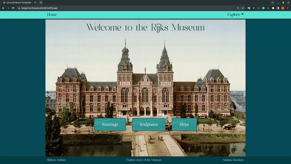
##### Preview

## Deployment link:

Insert your Deployment link here:

https://tangerine-mousse-a56c68.netlify.app/

## Timeframe & Working Team (Solo/Pair/Group):

It was a pair project and we had 48 hours to complete it. 
Our Team members were Ridwan Arshad (https://github.com/Riddles-sys) and Arianna Giordano (https://github.com/silverjana/)

## Technologies Used

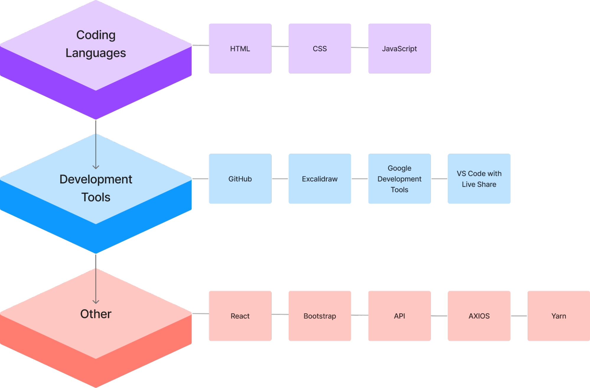
##### Tech-stack
## Brief

The project was to build a React application that consumes a public API.

It must consume a public API, and have several components. The project must also be deployed online and accessible to the public.

## Planning

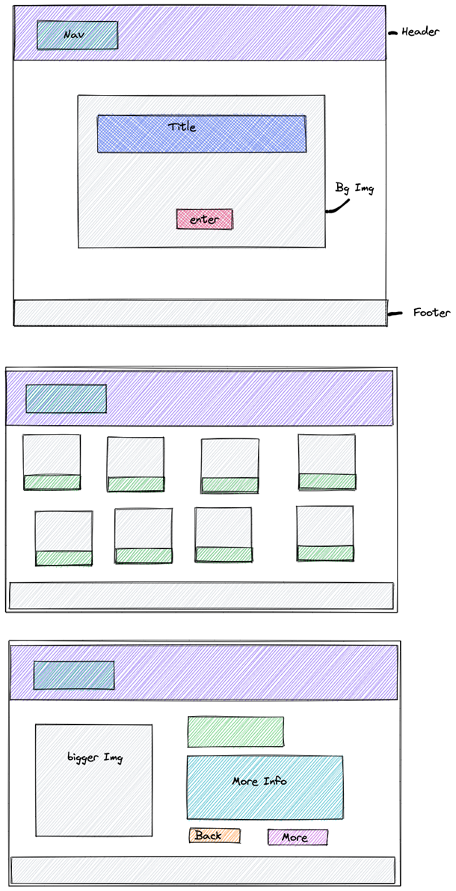
##### Wire-frame

## Components plan:

### App.js 
All imports, routes

### Navbar
Navigation  bar with brand (home)+ link (list)

### Footer
text-links
### Main
image + title + button ( nav to list)
List
cards ( GET request)
image + title
### OneObject
(GET request , object.id is target value)
image, title, information about object, button for list

Due to time constraints, tasks were shared, debugging was done together. Everything was completed using VS Live Share whilst on Zoom to communicate together. Screen sharing was also made use of as Live Share had a few errors where it wouldn’t update for the non-root person whilst running Yarn.

## Build/Code Process

We started by creating new components and importing them all and installing the frameworks, creating new ones when necessary. 

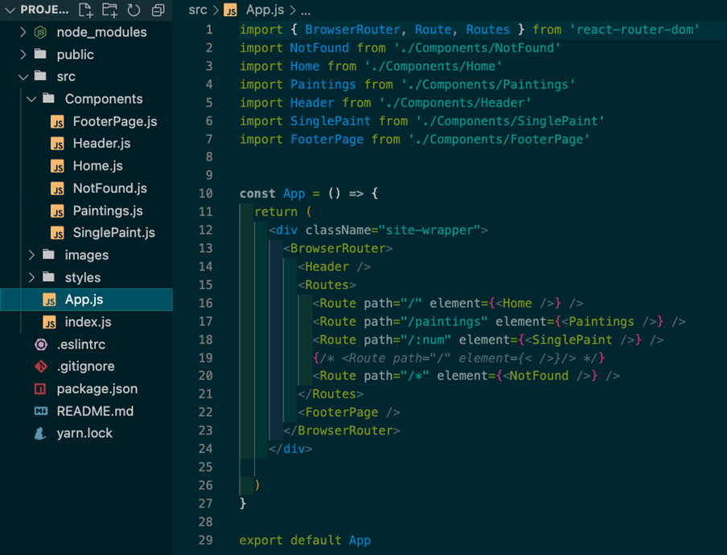
##### App.js

We moved on to creating an Axios GET request using an API key and mapping the data to display the information we wanted. In this instance we wanted to extract the title, image, object number and Id. These were dynamically placed into Bootstrap cards.

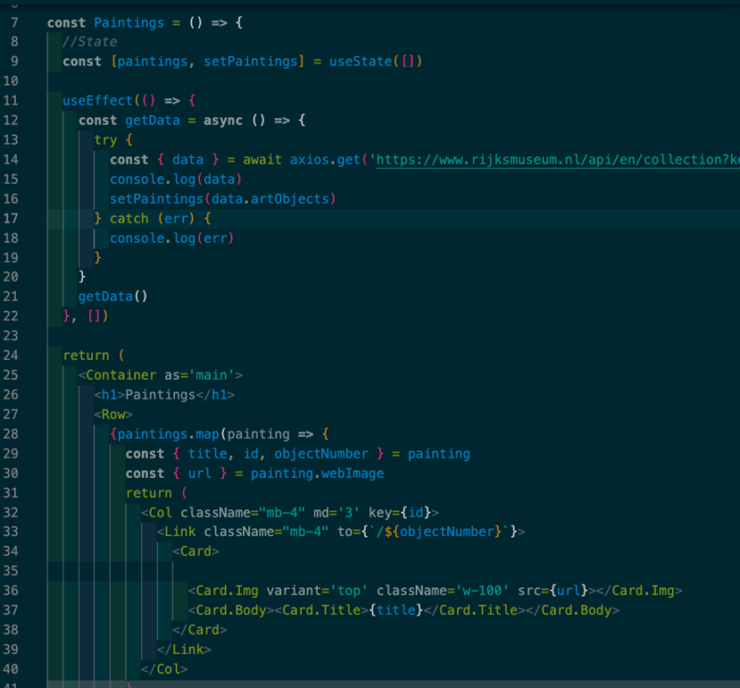
##### Pulling in data of paintings

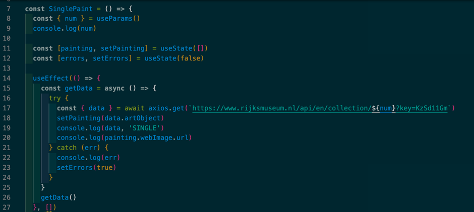
##### getData

We used the useParams method to hook the extracted data from the first request to make a new GET request. The API was quite complex and required the object number to attain a description of the object so we could display each object with more information. If there was no english description available a long title was displayed instead - this was achieved through a dynamic conditional statement.

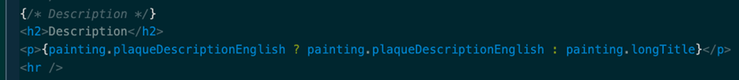
##### Conditional for paintings

We created a Homepage with the background image of the museum and an Enter button to welcome the user of the App. 

The navigation bar was placed within the header for ease of access.

We incorporated a Link to the Museum website in the footer, along with our GitHub pages as the creators of the app

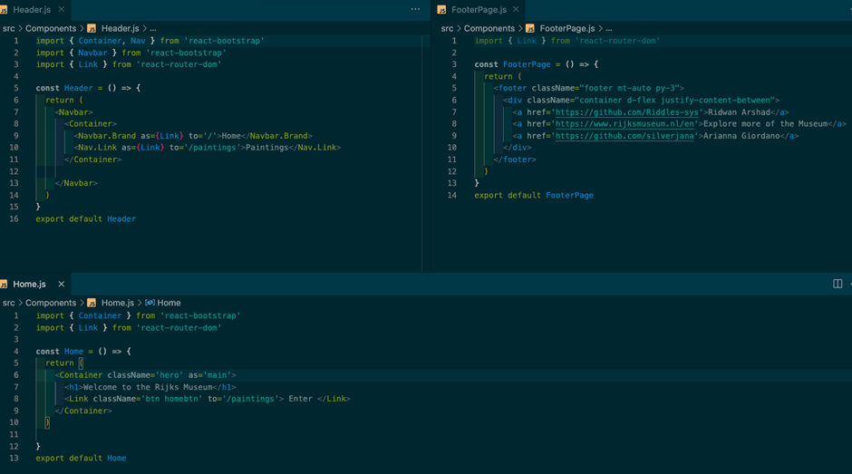
##### Components

## Challenges

The first problem we came across was mapping the data from the API into the cards as an error was displaying saying “paintings.map is not a function”. 

With the use of console.log I realised the issue was with the definition of painting and the nested artObjects was not being called properly. To correct this I used setPaintings to data.artObjects and defined painting to the nested data which would be received from the promise.

Insomnia was used to locate the nested data.

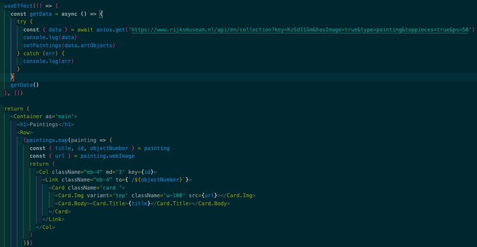
##### useEffect for paintings

The second issue we ran into was getting the image to display on the Single Painting page. 

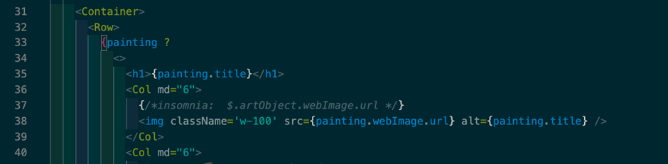
##### Single painting issue

The solution was to create a conditional statement to verify that the data was received before displaying the image.

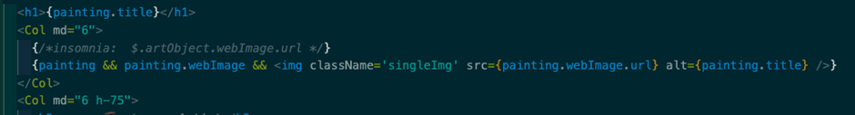
##### Condition for paintings
## Wins

We understood how to request and use the API key, and we took advantage of the particular system this API uses to display further information with a second request in a new page.

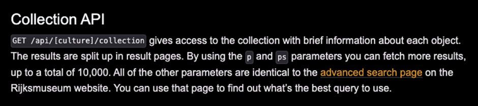
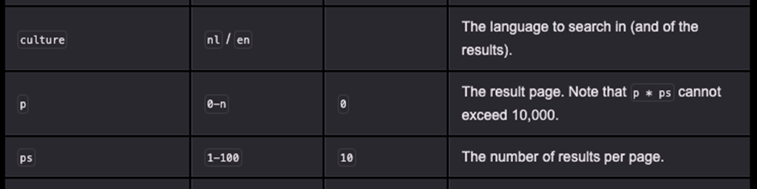
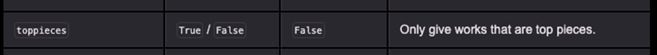
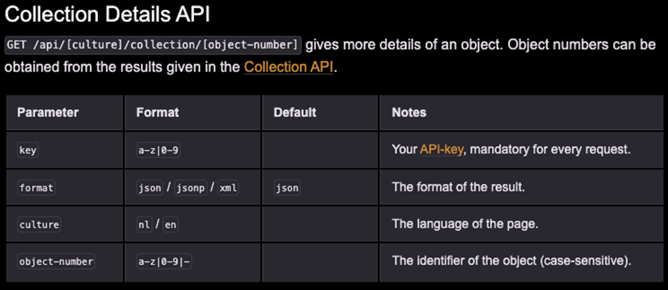
##### API details

Although it was the first time practicing with React and API due to good teamwork we built a working network of components in a short amount of time with little to no debugging due to effectively using console.log.

A final win was that there were no readily visible bugs with the code as everything was being thoroughly checked by the two of us during the development of the web app.

## Key Learnings/Takeaways

Completing this project has increased my confidence in my ability to effectively use React and Bootstrap to pull API information and display it within an aesthetically pleasing manner. I found myself being able to explain the process effectively to my partner and make corrections in the syntax but also in the layout of the code - when needed. 

I became more comfortable with programming with a partner on Live Share, and organsing our time effectively. Unfortunately, due to an issue with Live Sharing whilst Yarn was active, it wasn’t always possible to code at the same time. However, this helped me to be able to explain my ideas and the process better to my partner along with debugging errors. This is true for both the fundamental code and for the styling. 

This project also helped me to further understand how to make use of Insomnia properly to understand the API which was being used. I would also say that my competence in using React has definitely increased, knowing when and how to use hooks will also be beneficial in future projects.

Although this wasn’t the first time I worked with a partner, it was the first time I worked with a partner for a complete project. At first I was a bit apprehensive as I wasn’t confident with the process of how it would happen due to differences in coding styles but as the process went on it became more comfortable. It also led to me making commitments to do project work, just for fun, with someone else

## Future Improvements

Future improvements would consist of:

Making a filter/search feature by artist name. The present API created limitations for this as the documentation was outdated.
I would like to change the theme and font to make it more elegant and in keeping with the Rijks Museum.
Some of the Cards didn’t allow me to align the titles to the centre. 
Look for a way to prevent ALL images loading at the same time and only the ones viewable - to increase loading times.
Create a login feature to be able to save the items which the user most likes so that it can be found with ease later.

